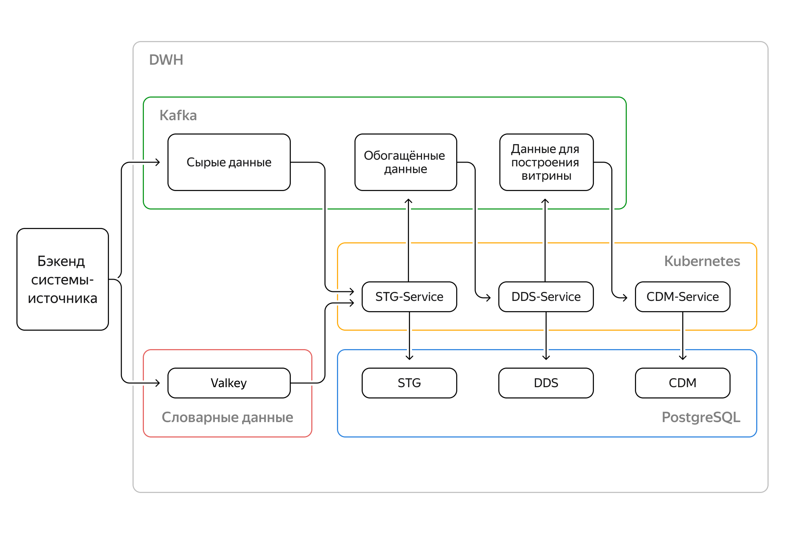
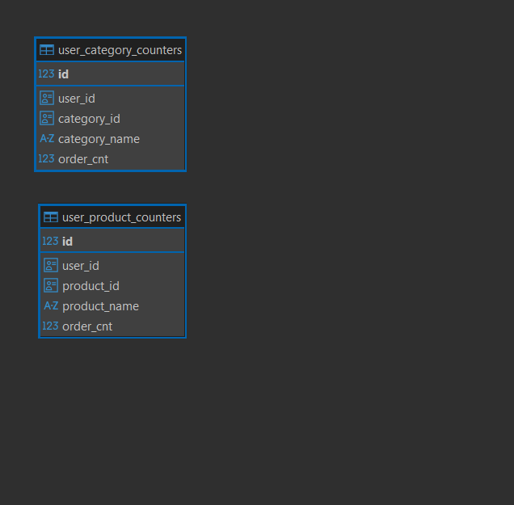
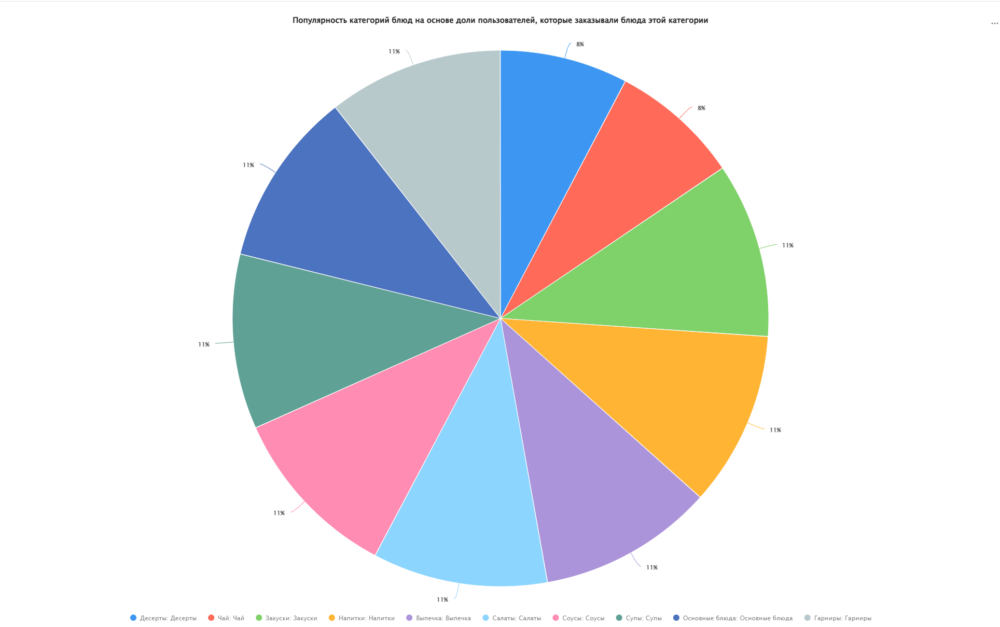

# 🌐 Cloud Technologies Project

Учебный проект по созданию потоковой обработки данных в облачной инфраструктуре.  
Система принимает события заказов из Kafka и Redis, обрабатывает их тремя независимыми микросервисами и формирует многоуровневое DWH: STG -> DDS -> CDM.  
Итоговые данные используются для аналитики (популярность блюд и категорий, активность пользователей) и визуализируются в Yandex DataLens.

---

## 🎯 Назначение хранилища

Хранилище обрабатывает поток событий заказов и преобразует их в структурированный вид.  
Архитектура включает три слоя:

- STG - хранение сырых событий без изменений  
- DDS (Data Vault 2.0) - детализированная модель: пользователи, продукты, категории, рестораны, заказы и связи между ними  
- CDM - витрина с агрегированной статистикой для аналитики  

Хранилище позволяет получать данные о популярности блюд, категорий и активности пользователей по всей сети ресторанов.

---

## 📦 Архитектура и микросервисы

Платформа состоит из трех независимых сервисов.  
Каждый сервис слушает свой Kafka-топик, обрабатывает данные и записывает результат в свой слой PostgreSQL.

### 1. STG-сервис - прием и обогащение данных

- читает сырое событие заказа из Kafka  
- обогащает данными из Redis (например, сопоставляет идентификаторы с названиями ресторанов)  
- сохраняет событие в таблицу `stg.order_events`  
- публикует сообщение в Kafka для DDS-сервиса  

### 2. DDS-сервис - слой Data Vault

- читает данные из Kafka-топика STG  
- выделяет сущности (user, product, category, restaurant, order)  
- записывает их в таблицы Data Vault  
- отправляет подготовленное сообщение в Kafka для CDM  

### 3. CDM-сервис - формирование витрин

- читает Kafka-топик DDS  
- формирует агрегаты:  
  - user_product_counters - количество заказов по каждому блюду  
  - user_category_counters - количество заказов по каждой категории  
- данные используются для аналитических дашбордов в Yandex DataLens  

---

## 📁 Структура репозитория

service_stg/ - сервис слоя STG
service_dds/ - сервис слоя DDS
service_cdm/ - сервис слоя CDM
sql_scripts/ - SQL-скрипты создания таблиц
img/ - схемы, диаграммы, дашборды
README.md
docker-compose.yml

---

## 🛠 Технологии

- Apache Kafka  
- PostgreSQL  
- Redis  
- Python  
- Docker / Kubernetes  
- Yandex Cloud  
- Yandex DataLens

---

## 🖼 Скриншоты

### 🏗 Архитектура проекта
  
*Общая архитектура платформы.*

### 📘 DDS слой (Data Vault)
  
*Модель данных DDS: hubs, links и satellites. Структура отражает пользователей, рестораны, продукты, категории и заказы, а также связи между ними.*

### 📊 CDM слой (витрины)
  
*Структура витрин CDM: user_product_counters и user_category_counters.*

### 📊 Популярность категории блюд на основе доли заказов, в которых были блюда этой категории
  
*Диаграмма показывает распределение заказов по категориям блюд.*

### 📊 Популярность блюд по количеству заказов, в которых было блюдо
  
*График показывает, какие конкретные блюда встречаются в заказах чаще всего.*

### 📊 Популярность категорий блюд по доле пользователей
  
*Доля пользователей, заказывавших блюда каждой категории.*

### 📊 Популярность блюд по числу уникальных пользователей
  
*Количество уникальных пользователей, заказавших каждое блюдо.*

---

## ⚠️ Примечание

Проект выполнялся в учебной инфраструктуре Яндекс.Практикума и не запускается локально, так как зависит от облачных сервисов (Kafka, Redis, PostgreSQL, Kubernetes).  
Репозиторий опубликован для демонстрации архитектуры, потоковой обработки данных и построения DWH.
